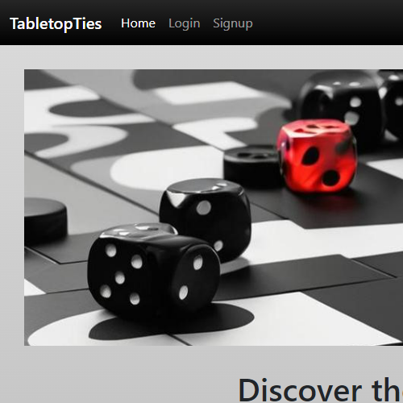

# TableTopTies

## Description
TableTopTies is an engaging online platform designed for tabletop gaming enthusiasts to connect and share their passion. With features that allow users to find events, create game entries, and join community-built gaming sessions, TableTopTies enhances the experience of gaming together. Secure profiles, dynamic event listings, and live group messaging enable users to foster new friendships and arrange game nights with ease. Whether you're into TTRPG, strategy games, or TCG, TableTopTies is your go-to network for finding like-minded players and exploring new gaming opportunities.

## Table of Contents

- [Installation](#installation)
- [Usage](#usage)
- [License](#license)
- [Badges](#badges)
- [Features](#features)
- [Credits](#credits)
- [Questions](#questions)

## Installation

If just visiting the site, please see the deployed application link in the [Usage](#usage) section, and then use or visit as desired. 

In order to test the code, please use `npm i` in order to install the required dependiencies listed in the package.json, `npm run seed` to seed pre-built test data, and then `npm run start` to start a local server version. 

For a list of dependencies and technologies used, please vist the [Features](#features) section.

## Usage

To visit the deployed application, click the following image:

Please revisit the [Description](#description) section, or skip to the [Features](#features) section to review application specific features.

## License

This [license](./LICENSE) enables reusers to copy and distribute the material in any medium or format in unadapted form only, for noncommercial purposes only, and only so long as attribution is given to the creator. 

## Badges

## Features

### App Features:
* **Event Discovery and Management:** Users can discover upcoming gaming events and manage their own events, leveraging a dynamic interface that allows for easy browsing and interaction.
* **Game Entry Creation:** Gamers can create entries for new games, including details such as game type, rules, and player requirements, which helps in organizing and finding players for less popular or new games.
* **Community Building Tools:** With integrated live group messaging, users can communicate in real time to discuss games, coordinate events, or just socialize, enhancing the sense of community.
* **Profile Customization:** Secure user profiles that can be customized with favorite game preferences, biography, and other personal touches that allow users to express themselves and find like-minded players.
* **Matchmaking System:** An innovative matchmaking feature suggests game events and other users with similar interests, improving the networking experience and making it easier to find suitable gaming partners.

### Technologies used:
* **Node.js and Express:** For robust server-side functionality.
* **Socket.io:** Enables real-time, bidirectional and event-based communication.
* **MySQL/Sequelize:** Utilized for database management and model querying, which supports complex user and event data handling.
* **Handlebars:** Simplifies the generation of HTML and helps in creating a dynamic user interface.
* **JavaScript & JSON:** For handling logic and data exchange.
* **Dotenv:** Manages environment variables independently of application code.
* **bcrypt:** Provides secure password hashing, enhancing application security.
* **CSS/Bootstrap:** Used for styling and responsive design, ensuring a seamless user experience across different devices.
* **Heroku:** Platform as a service (PaaS) that enables developers to build, run, and operate applications entirely in the cloud.

## Credits

Version 1.5 Deployed April 15, 2024
- Originally this version was forked from a previous group project in bootcamp and completely upgraded. 
In this version, the work was solo except for some wonderful help from [Kevin Dallas](https://github.com/okni-c) who helped debug and fix an issue grabbing session id for socket.io functionality. Check out his work!

Version 1.0 Deployed Feb. 11, 2024
  + https://desolate-coast-16417-f21d4a060ca1.herokuapp.com/
  + https://github.com/Gerlach0130/tabletop-ties 
  + Originial contributors: 
    * [Jess](https://github.com/jskelly8) | Fullstack
    * [Michael](https://github.com/Gerlach0130) | Initialization of project files, front end JS, CSS Styling
    * [Andria](https://github.com/EowynStark) | Original attempt at utilizing socket.io,  research, presentation materials, backend initialzation 
    * [CJ](https://github.com/cjva24) | Original handlebars initialzation 

## Questions

If you have any questions, feel free to reach out to me via [GitHub](https://github.com/jskelly8/) or email me at jessskelton888@gmail.com.